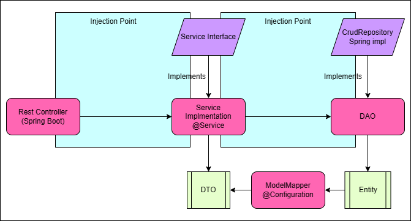

# Taller 1
<div align="center">
<p align="left">
   
</p>

</div>

Este repositorio contiene el código fuente de una API REST desarrollada en Java utilizando SpringBoot, SpringData, Lombok, ModelMapper, y H2. Esta API es parte de la aplicación del taller 1 realizado con NEORIS.

## Dependencias utilizadas
- Java 11
- SpringBoot 2.7.6
- SpringData
- Lombok
- ModelMapper
- H2
- Maven

## Descarga y configuración
Para descargar este repositorio, puedes clonarlo desde la terminal utilizando el siguiente comando:
```bash
git clone https://github.com/MariaCamilaMorales/taller1-neoris.git
```
Una vez que tengas el repositorio en tu máquina local, puedes importarlo en tu IDE de preferencia (por ejemplo, IntelliJ IDEA o Eclipse) como un proyecto Maven.

Para configurar la base de datos, debes crear una base de datos MySQL en tu servidor local y configurar las credenciales en el archivo application.properties, el cual se encuentra en la ruta src/main/resources. El contenido de este archivo debe ser el siguiente:
```properties  
# Configuracion server
server.port=8080

# Configuracion base datos
spring.datasource.url=jdbc:h2:mem:testdb
spring.datasource.driverClassName=org.h2.Driver
spring.datasource.username=sa
spring.datasource.password=password
spring.jpa.database-platform=org.hibernate.dialect.H2Dialect
```
Debes reemplazar las credenciales de acceso a la base de datos con las tuyas propias.

## Diagrama de. arquitectura
A continuación se muestra un diagrama de la arquitectura de la aplicación:


La aplicación sigue el patrón MVC (Modelo-Vista-Controlador), donde los Controllers se encargan de recibir las peticiones HTTP, los Services contienen la lógica de negocio y se comunican con los Repositories, y los Repositories interactúan con la base de datos.

## Documentacion Swagger
Para ver la documentación de la API, puedes acceder a la siguiente URL: http://localhost:8080/doc/swagger-ui/index.html
y en el explorer colocar /v3/api-docs

## Validacion de Build cloud
```
mvn clean package 
java -jar -Dspring.config.name=application-local target/TuHome-0.0.1-SNAPSHOT.war
```

## Profile dev

1. Asegúrate de tener el archivo `application-local.properties` en el mismo directorio que `application.properties`. Verifica que el archivo exista y contenga las propiedades específicas para el perfil "local".

2. En IntelliJ IDEA, ve a la ventana de configuración de ejecución haciendo clic en la flecha desplegable junto al botón de ejecución en la barra de herramientas superior.

3. Selecciona la configuración de ejecución que estás utilizando para tu aplicación Spring Boot (por ejemplo, "Application" o "Spring Boot Application").

4. En la pestaña "Configuration" (Configuración), verifica que hayas configurado correctamente el campo "Active Profiles" (Perfiles Activos) con el valor "local".

5. En la misma pestaña "Configuration", busca el campo "Environment variables" (Variables de entorno).

6. Haz clic en el botón "+" para agregar una nueva variable de entorno.

7. En el campo "Name" (Nombre), ingresa `SPRING_CONFIG_NAME`.

8. En el campo "Value" (Valor), ingresa `application-local`.

9. Guarda los cambios y ejecuta tu aplicación Spring Boot.

## Documentación útil

- [Documentación oficial de SpringBoot](https://docs.spring.io/spring-boot/docs/current/reference/htmlsingle/)
- [Documentación oficial de SpringData](https://docs.spring.io/spring-data/jpa/docs/current/reference/html/#reference)
- [Documentación oficial de Lombok](https://projectlombok.org/features/)
- [Documentación oficial de ModelMapper](http://modelmapper.org/getting-started/)
- [Documentación oficial de MySQL](https://dev.mysql.com/doc/)
- [Documentación oficial de Maven](https://maven.apache.org/guides/index.html)
